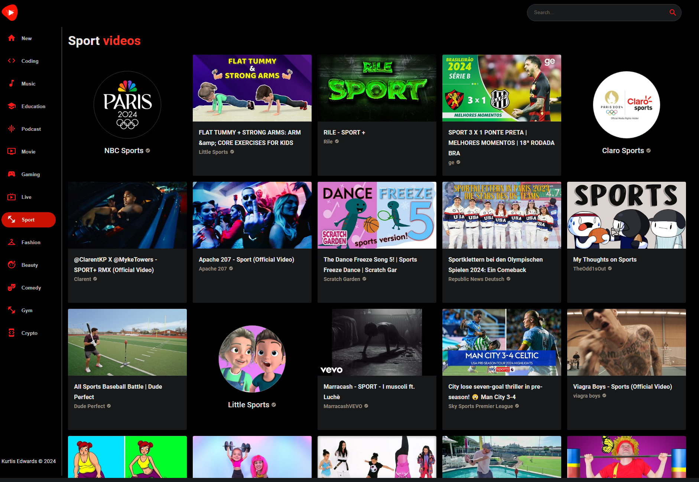

# YouTube Clone

In this project, I developed a fully functional YouTube clone, mimicking the core features and design of the popular video-sharing platform. The project involved creating a dynamic, responsive web application using a combination of modern web development technologies.

## Technologies Used:

- HTML & CSS: For structuring and styling the user interface, ensuring a visually appealing and user-friendly experience.
- JavaScript: Enabled interactivity and functionality, allowing the application to respond dynamically to user actions.
- React: Utilized for building the user interface components, ensuring efficient rendering and state management. React's component-based architecture allowed for modular and reusable code.
- Material UI: Incorporated Material Design principles through Material UI, providing a sleek and consistent look across the application. This library also facilitated the implementation of responsive design, ensuring the application works well on various devices.
- YouTube API: Integrated with the YouTube API to fetch real-time data such as videos and channels. This API allowed the application to display content similar to YouTube, including search functionality and video playback.

## Features:

- Homepage: A dynamic homepage displaying new videos and categories.
- Search Functionality: Users can search for videos and channels using the YouTube API, with search results displayed in real-time.
- Video Playback: Embedded video player allowing users to watch videos directly within the application, with related videos__ displayed alongside.
- Responsive Design: The application is fully responsive, adapting seamlessly to different screen sizes and devices.

## Outcome:

The YouTube clone project showcases my ability to create a complex, feature-rich web application using modern web development technologies. It highlights my skills in front-end development, API integration, and UI/UX design. The project also provided valuable experience in working with third-party APIs and implementing responsive, user-centric interfaces.
